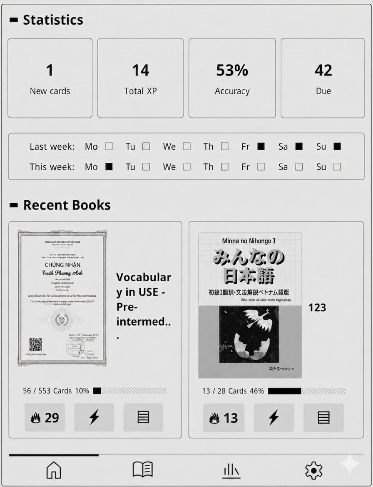
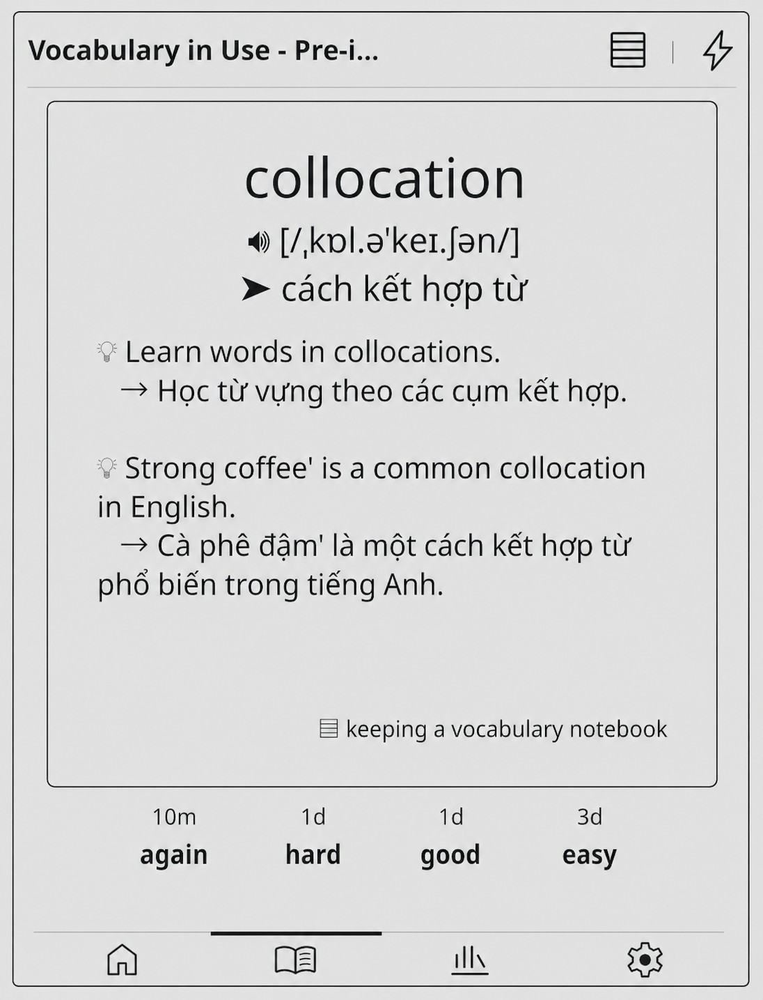
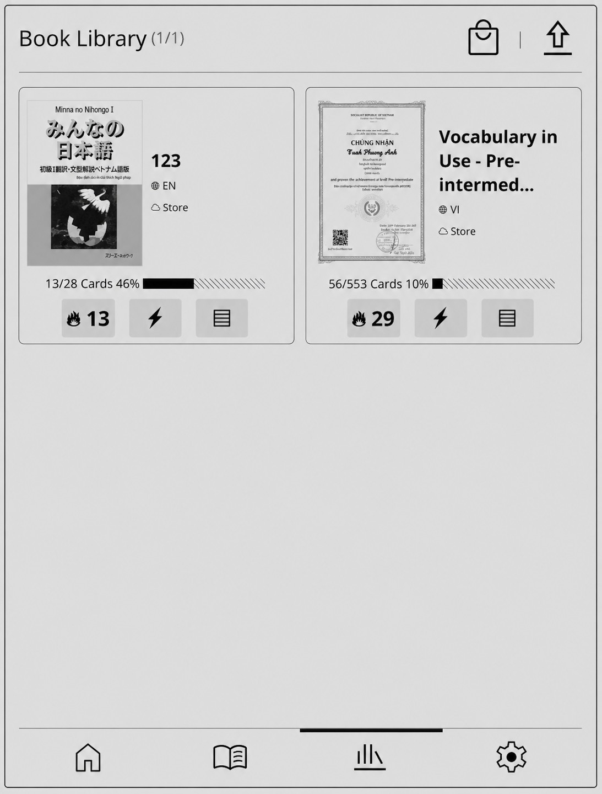
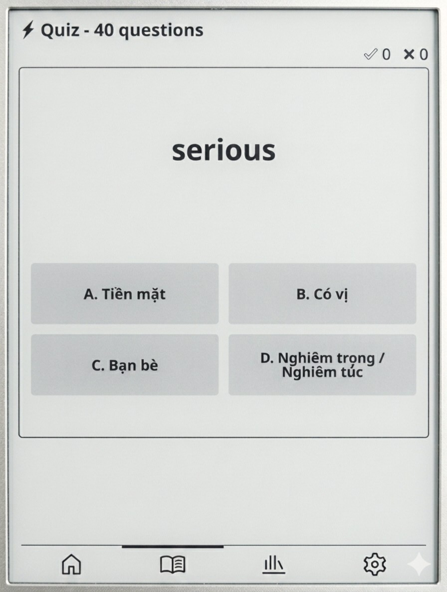
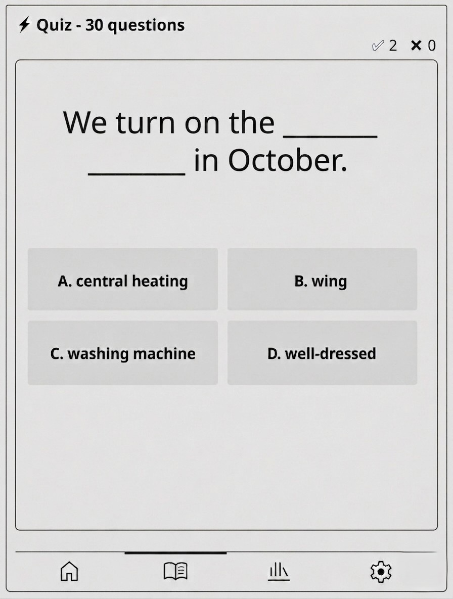
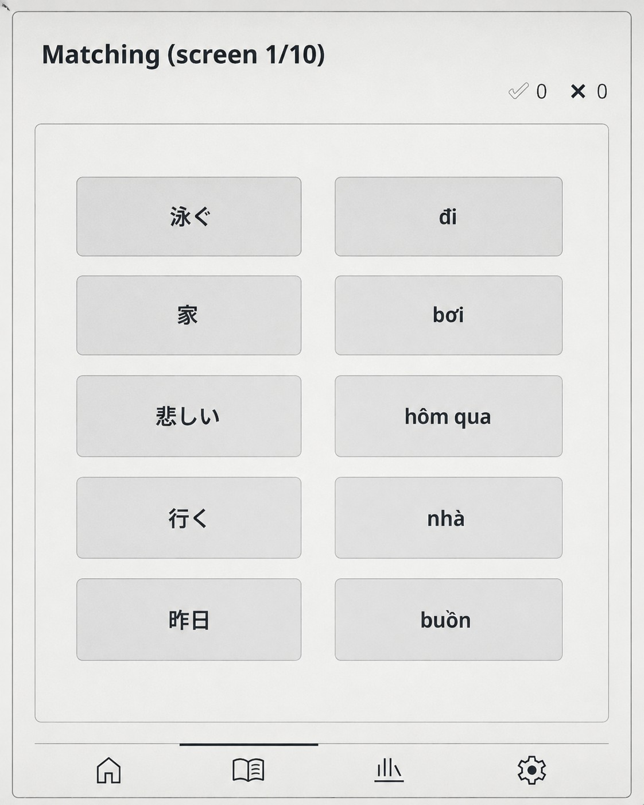

# MemDeck - Ứng dụng học ngoại ngữ bằng Flashcard cho KOReader
# MemDeck - Flashcard Language Learning App for KOReader

## 🎨 Giao diện chính / Main Interface

  <table>
    <!-- Hàng 1: 3 ảnh đầu -->
    <tr>
      <td></td>
      <td></td>
      <td></td>
    </tr>
    <tr>
      <td align="center"><b>🏠 Trang chủ</b> Home</td>
      <td align="center"><b>📖 Học</b> Study</td>
      <td align="center"><b>📚 Thư viện</b> Test</td>
    </tr>
    <!-- Hàng 2: 3 ảnh tiếp theo -->
    <tr>
      <td></td>
      <td></td>
      <td></td>

      <td></td>
    </tr>
    <tr>
      <td align="center"><b>📝 Quiz</b> Test</td>
      <td align="center"><b>📝 Cloze</b> Library</td>
      <td align="center"><b>📝 Matching</b> Matching</td>
      <td></td>
    </tr>
  </table>

## 🚀 Cách cài đặt / Installation
Vui lòng truy cập Website: https://doc-online.io.vn để tải plugin và xem hướng dẫn chi tiết.

Please visit Website: https://doc-online.io.vn to download the plugin and see detailed instructions.

## 📖 Giới thiệu / Introduction

**MemDeck** là một plugin học ngoại ngữ dành cho **KOReader** (nền tảng đọc sách trên các thiết bị e-ink như Kindle, Kobo, PocketBook, android...). Ứng dụng giúp người dùng học từ vựng hiệu quả thông qua phương pháp flashcard kết hợp hệ thống lặp lại ngắt quãng (SM-2).

**MemDeck** is a language learning plugin for **KOReader** (an e-ink reader platform for devices like Kindle, Kobo, PocketBook,android...). It helps users learn vocabulary effectively through flashcards combined with the spaced repetition system (SM-2).

---

## ✨ Tính năng chính / Key Features

### 🎯 Học tập thông minh / Smart Learning

| Tiếng Việt | English |
|------------|---------|
| Hệ thống lặp lại ngắt quãng SM-2: Tối ưu hóa thời gian ôn tập dựa trên mức độ nhớ của người dùng | SM-2 Spaced Repetition System: Optimizes review time based on user's memory level |
| Chế độ học Flashcards: Xem mặt trước (từ vựng) và mặt sau (nghĩa, ví dụ, phát âm) | Flashcard Mode: View front (vocabulary) and back (meaning, examples, pronunciation) |
| Chế độ Quiz: Kiểm tra kiến thức với câu hỏi trắc nghiệm | Quiz Mode: Test knowledge with multiple-choice questions |
| Chế độ Cloze Test: Điền từ còn thiếu vào câu | Cloze Test Mode: Fill in the missing words in sentences |
| Chế độ Matching Test: Ghép các cặp tư vựng - nghĩa | Matching Test Mode: Match the vocabulary pairs with their meanings. |
| Hỗ trợ đa ngôn ngữ: VI, EN, JA, KO, ZH, FR, DE, ES, RU, TH | Multi-language support: VI, EN, JA, KO, ZH, FR, DE, ES, RU, TH |

### 📚 Quản lý sách và thẻ / Book & Card Management

| Tiếng Việt | English |
|------------|---------|
| Tải sách từ Store Online: Kết nối server để tải bộ thẻ theo chủ đề | Download from Online Store: Connect to server to download themed card sets |
| Import từ file CSV: Tự tạo bộ thẻ từ file Excel/CSV | Import from CSV file: Create custom card sets from Excel/CSV files |
| Xem trước nội dung: Duyệt danh sách thẻ theo chủ đề trước khi học | Preview content: Browse cards by topic before studying |
| Dừng và học tiếp sách bất kỳ | Pause and resume any book |
| Theo dõi tiến độ: Phần trăm hoàn thành, số thẻ đã học, số thẻ đến hạn | Progress tracking: Completion percentage, learned cards, due cards count |
| Ưu tiên chủ đề: Đánh dấu chủ đề quan trọng cần học trước | Topic priority: Mark important topics to learn first |

### 📊 Thống kê và theo dõi / Statistics & Tracking

| Tiếng Việt | English |
|------------|---------|
| Thống kê học tập: Số thẻ đã học, số thẻ mới, tỷ lệ đúng | Study statistics: Learned cards, new cards, accuracy rate |
| Tích lũy XP theo dữ liệu: Thẻ mới học, thẻ cũ ôn lại, kết quả bài test | XP accumulation based on: New cards learned, old cards reviewed, test results |
| Lịch sử học: Xem hoạt động theo ngày/tuần | Study history: View daily/weekly activity |

### 🎨 Giao diện tối ưu cho thiết bị ebook / E-ink Optimized UI

| Tiếng Việt | English |
|------------|---------|
| Responsive layout: Tự động điều chỉnh kích thước theo độ phân giải màn hình | Responsive layout: Automatically adjusts size based on screen resolution |
| Hỗ trợ cảm ứng và phím cứng: Vuốt để chuyển trang, nhấn giữ để mở menu | Touch and hardware key support: Swipe to navigate pages, long press for menus |
| Bottom bar với 4 tab chính: Trang chủ, Học, Thư viện, Cài đặt | Bottom bar with 4 main tabs: Home, Study, Library, Settings |

---

## 📦 Yêu cầu hệ thống / Requirements

| Thành phần / Component | Yêu cầu / Requirement |
|------------------------|------------------------|
| **KOReader** | Phiên bản 2024.01 trở lên / Version 2024.01 or higher |
| **Thiết bị / Device** | Kindle, Kobo, PocketBook, Android với KOReader |
| **Dung lượng / Storage** | ~10MB + dung lượng sách / + book data |
| **Ngôn ngữ / Languages** | VI, EN, JA, KO, ZH, FR, DE, ES, RU, TH |

---

## 🚀 Cách cài đặt / Installation

Vui lòng truy cập Website: https://doc-online.io.vn để tải plugin và xem hướng dẫn chi tiết.

Please visit Website: https://doc-online.io.vn to download the plugin and see detailed instructions.

---

## 📞 Liên hệ / Contact

| Tiếng Việt | English |
|------------|---------|
| **Website** | https://doc-online.io.vn |
| **Email** | support@doc-online.io.vn |
| **GitHub** | [https://github.com/yourusername/memdeck.koplugin](https://github.com/doconline2026-cell/memdeck) |

